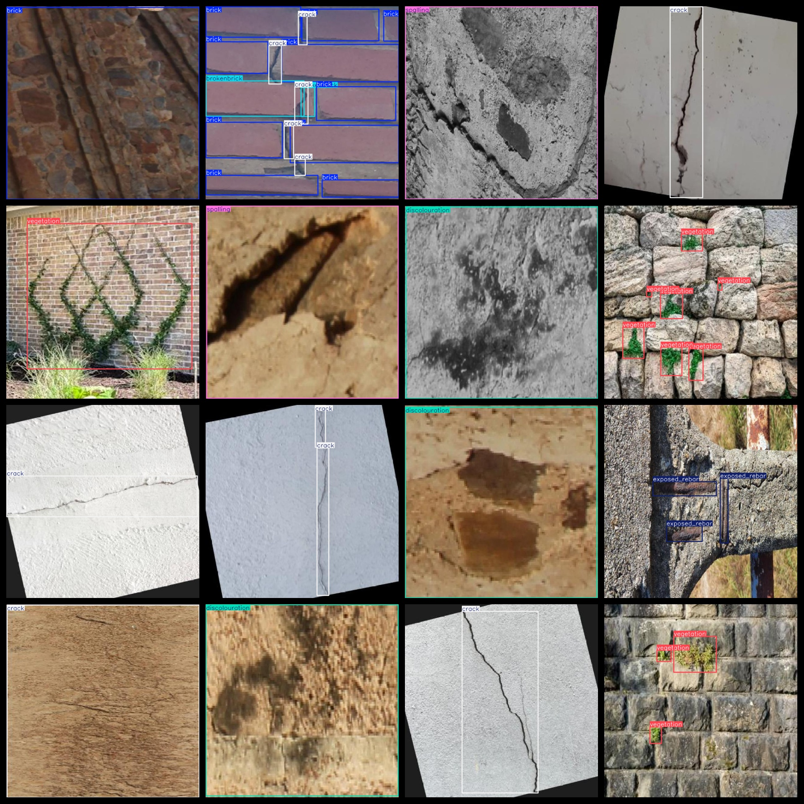
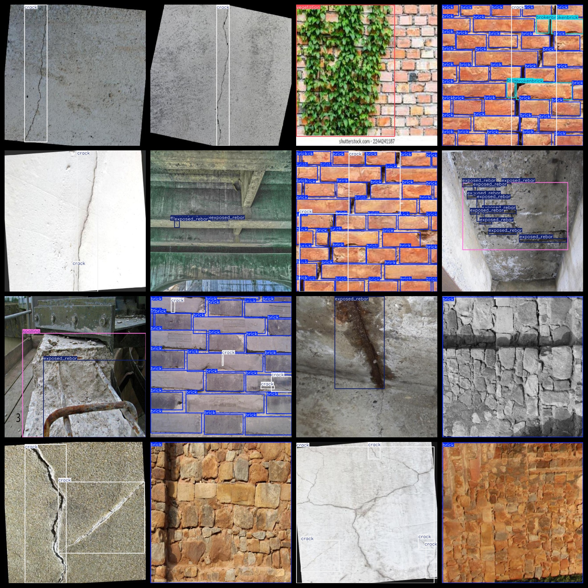
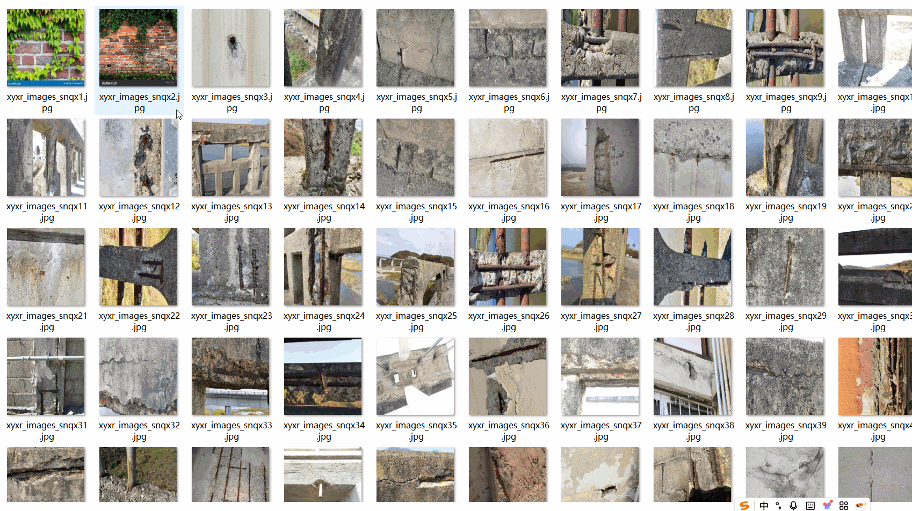

# [Object Detection] 7-class Building Surface Defect Dataset: 10,000 Images in YOLO+VOC Format

[Object Detection] 7-class Building Surface Defect Dataset: A 10,000-image dataset in YOLO+VOC format.

Dataset format: VOC format + YOLO format.

The zip file contains three directories: JPEGImages, Annotations, and labels.

In the JPEGImages directory, there are a total of 10,000 images in JPEG format.

In the Annotations directory, there are a total of 10,000 XML files.

In the labels directory, there are a total of 10,000 txt files.

Number of label categories: 7

Label names: ["brick", "brokenbrick", "crack", "discolouration", "exposed_rebar", "spalling", "vegetation"]

Label names: ["Brick", "Stone", "Crack", "Discoloration", "Exposed Rebar", "Rupture", "Vegetation"]

Box count for each label (note that the order of classes in YOLO format does not match this, but is based on the classes.txt in the labels directory):

brick box count = 13,126

brokenbrick box count = 2,568

crack box count = 6,902

discolouration box count = 751

exposed_rebar box count = 3,449

spalling box count = 1,319

vegetation box count = 6,590

Total box count: 34,705

Image resolution (pixels): Clear

Image enhancement: No

Label shape: Rectangular boxes used for target detection recognition.

Important note: No guarantee is made regarding the accuracy or weights of models trained on this dataset. The dataset is provided with accurate and reasonable annotations only.
## Images

---

Here is a pay link on Stripe (https://buy.stripe.com/3cs8yP7sY87d0vu9AB). Please contact me lonlonago@foxmail.com after funding $89, and I will send you a complete data files, thank you!

